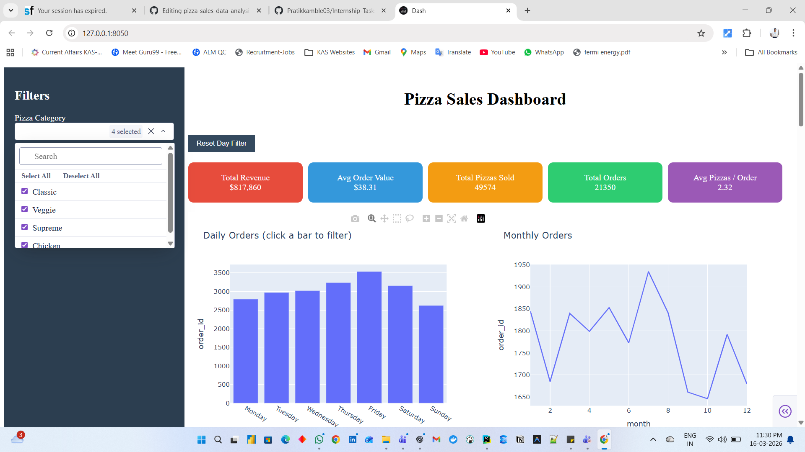
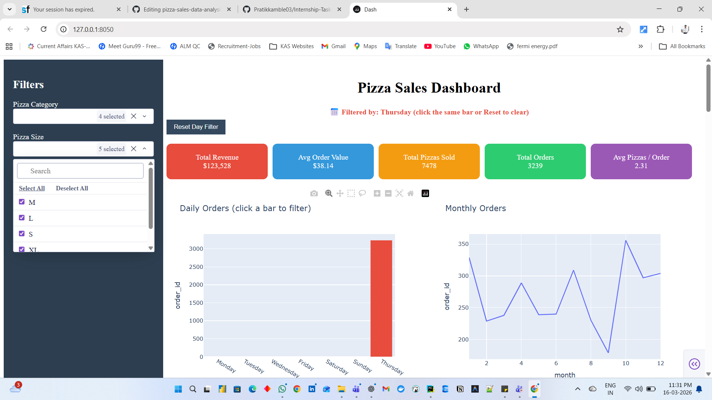
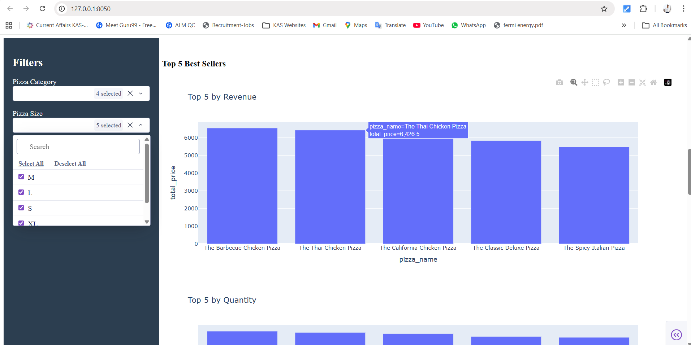
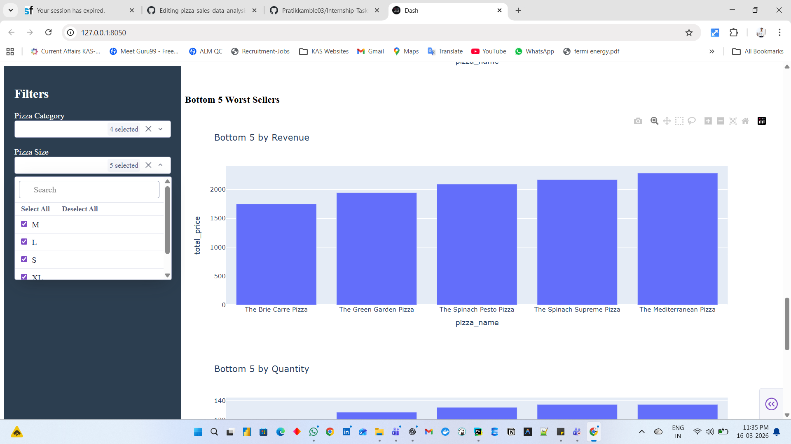

# 🍕 Pizza Sales Data Analysis & Interactive Dashboard

<div align="center">


<br/>

> **End-to-End Data Analytics Project** | Business / Sales Analytics Domain

*Transforming raw pizza sales data into actionable business insights through EDA and interactive dashboards.*

</div>

---

## 📌 Project Overview

This project performs **end-to-end data analysis** on pizza sales data to uncover meaningful business insights. The analysis combines **Exploratory Data Analysis (EDA)** with an **interactive dashboard** built using Dash and Plotly to visualize sales trends, customer ordering behavior, and product performance.

The goal of this project is to demonstrate how data analytics and visualization can transform raw business data into **actionable insights** for decision-making.

| Field | Details |
|---|---|
| **Project Type** | End-to-End Data Analytics |
| **Domain** | Business / Sales Analytics |
| **Tools** | Python, Pandas, Plotly, Dash |
| **Environment** | Jupyter Notebook, Python Virtual Environment |

---

## 🎯 Project Objectives

- 📊 Analyze overall pizza sales performance
- 🏆 Identify top-selling and least-selling pizzas
- 📅 Evaluate daily and monthly order trends
- 🍕 Understand sales distribution by pizza category and size
- 🖥️ Build an interactive dashboard for dynamic data exploration

---

## 🔄 Project Workflow

```
Raw Sales Data
      ↓
Data Cleaning & Preprocessing
      ↓
Exploratory Data Analysis (EDA)
      ↓
KPI Calculations
      ↓
Data Visualization
      ↓
Interactive Dashboard (Dash + Plotly)
      ↓
Business Insights
```

> 💡 *Optional: Replace the above with a workflow diagram image.*
> ```
> 
> ```

---

## 📊 Dashboard Preview

<div align="center">

| Preview | Description |
|---|---|
|  | **Full Dashboard** — Complete interactive view |
|  | **KPI Metrics** — Key performance indicators |
|  | **Sales Trends** — Daily & monthly trends |
|  | **Top Selling Pizzas** — Best performers |
|  | **Bottom Selling Pizzas** — Underperformers |

</div>

---

## 📈 Key Performance Indicators (KPIs)

The dashboard displays the following business metrics for a quick overview of sales performance:

| KPI | Description |
|---|---|
| 💰 **Total Revenue** | Overall revenue generated from all pizza sales |
| 🧾 **Total Orders** | Total number of orders placed |
| 🍕 **Total Pizzas Sold** | Total quantity of pizzas sold |
| 💳 **Average Order Value** | Average revenue per order |
| 📦 **Avg Pizzas per Order** | Average number of pizzas per order |

---

## 📉 Data Analysis & Visualizations

### 📆 Sales Trends
- Daily order trends
- Monthly order trends

### 💵 Revenue Distribution
- Sales breakdown by pizza category
- Sales breakdown by pizza size

### 🏆 Product Performance — Top 5
- Top 5 pizzas by revenue
- Top 5 pizzas by quantity sold
- Top 5 pizzas by number of orders

### 📉 Underperforming Products — Bottom 5
- Bottom 5 pizzas by revenue
- Bottom 5 pizzas by quantity sold
- Bottom 5 pizzas by number of orders

---

## 🛠️ Technologies Used

| Category | Tools |
|---|---|
| **Programming Language** | Python |
| **Data Analysis** | Pandas, NumPy |
| **Data Visualization** | Matplotlib, Seaborn, Plotly |
| **Dashboard Framework** | Dash |
| **Development Environment** | Jupyter Notebook, Python Virtual Environment |

---

## 📂 Project Structure

```
pizza-sales-data-analysis/
│
├── 📁 data/
│   └── pizza_sales.csv              # Raw sales dataset
│
├── 📁 images/
│   ├── dashboard.png                # Full dashboard screenshot
│   ├── kpi_cards.png                # KPI metrics screenshot
│   ├── sales_trends.png             # Sales trends screenshot
│   ├── top_sellers.png              # Top sellers screenshot
│   ├── bottom_sellers.png           # Bottom sellers screenshot
│   └── workflow.png                 # Project workflow diagram
│
├── 📄 dashboard.py                  # Dash interactive dashboard app
├── 📓 pizza_sales_analysis.ipynb    # Jupyter Notebook — EDA & analysis
├── 📄 requirements.txt              # Python dependencies
└── 📄 README.md                     # Project documentation
```

---

## ⚙️ Installation & Setup

### 1️⃣ Clone the Repository

```bash
git clone https://github.com/Keertiraj2004/pizza-sales-data-analysis.git
```

### 2️⃣ Navigate to the Project Folder

```bash
cd pizza-sales-data-analysis
```

### 3️⃣ Install Dependencies

```bash
pip install -r requirements.txt
```

### 4️⃣ Run the Dashboard

```bash
python dashboard.py
```

> 🌐 Open the dashboard link displayed in your terminal in a browser (usually `http://127.0.0.1:8050/`).

---

## 📊 Example Business Insights

Some key insights derived from the analysis:

- 🍕 Certain pizza **categories contribute a higher revenue share** than others
- 📅 **Sales increase during weekends**, indicating peak ordering days
- 📦 Some pizzas generate **high order volume but lower revenue**, suggesting pricing opportunities
- 📉 Identifying **low-performing pizzas** helps optimize the menu and reduce costs

---

## 🚀 Future Improvements

- [ ] 🌐 Deploy the dashboard online (Heroku / Render / AWS)
- [ ] 🤖 Add sales forecasting using Machine Learning
- [ ] 🗄️ Integrate SQL database for scalable data storage
- [ ] ⏱️ Add real-time analytics capabilities

---

## 👨‍💻 Author

<div align="center">

**Keertiraj Kamble**
*Artificial Intelligence & Data Science Student*

[](https://github.com/Keertiraj2004)

</div>

---

<div align="center">

⭐ *If you found this project helpful, please consider giving it a star!* ⭐

</div>
